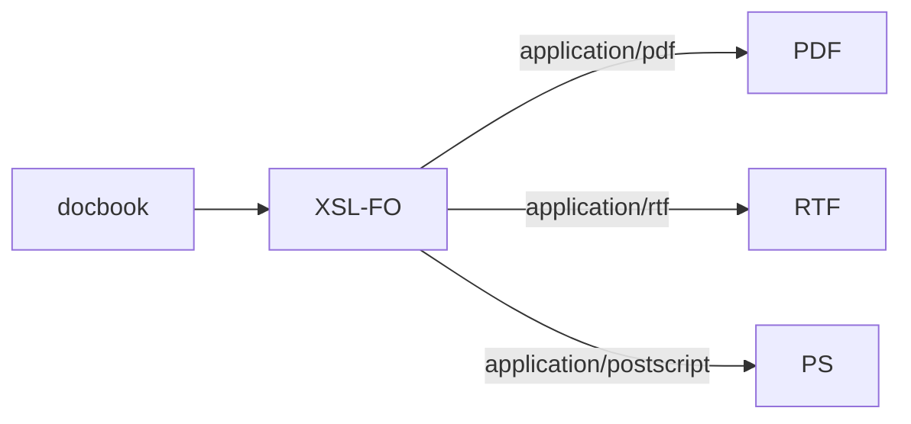

# 简介

由于 jdocbook 已经多年不更新，所以制作了其替代品。总之这是个 jdocbook 的替代品而不是复制品，本项目最大限度保持与 jdocbook
的兼容，但也有部分特性进行了变更。整体的构建目标如下：

1. 定义以 docbook 为核心文档转换流程。
1. 定义基于 maven 的文档工程结构。
1. 给出基于 maven 的转换插件。
1. 给出基于 commons-vfs 的资源定位方案。
1. 给出针对中文的 docbook-xslt 扩展。
1. 给出针对 ooxml 的 docbook-xslt 扩展

# 用法

在 1.0.1 的实现中给出了前五项的实现。第六项计划在 1.1.0
中实现。本文以 [demo-docbook](https://gitee.com/qq353586539/demo-docbook) 为例说明 maven-plugin 的用法。

## 目录结构

```
demo-docbook
 ├─src
 │  └─main
 │      ├─docbook                            # 放 docbook 的 xml 文件（文档本身）建议分语言地区存放，便于进行翻译工程
 │      │  └─zh-CN                           # 分语言地区的文件夹
 │      ├─docx                               # 生成 docx 用的资源文件，比如样式表，如果放在这个位置，说明这些资源仅用于支持本文档工程（当前不启用）
 │      ├─fonts                              # 字体文件，仅用于本文档工程的字体，用于 fop 渲染 pdf 时使用，需要另行编写和指定 fop 的配置（与 jdocbook 不同）
 │      ├─plantuml                           # 与 taotao-docbook 无关，在 demo 中用于基于 plantuml 生成图片，并进行测试
 │      ├─style                              # 仅用于本文档工程的样式与样式资源（主要是图片）
 │      └─xslt                               # 本文档工程扩展的 xslt 转换规则，即便是只使用 taotao-docbook 提供的转换规则，也建议像 demo-docbook 一样进行封装 
 └─target
     └─docbook                               # 工作目录, 插件工作过程中生成的文件和最终生成的文件都在这里
        ├─publish                            # 生成的最终制品文件夹
        │  ├─html                            # 生成的 html 的目录
        │  └─pdf                             # 生成的 pdf 文件的目录
        └─staging                            # 中间产物目录
            ├─docx                           # docx 的中间产物，散装的 ooxml
            ├─fo                             # fo 文件目录，用于后续进行 fop 渲染，与 jdocbook 不同，这里没删除
            ├─fonts                          # 汇总后的字体目录
            └─resource_root                  # 汇总后的资源目录（ docbook 中图片的引入路径的相对路径就是以这里为基础）
                ├─css                        # css 主要用于生成 html 后使用
                └─images                     # 图片，包括样式图片和内容图片
```

## 流程与 goals

插件的基本工作流程如下：


1. **清理** 该过程删除 _工作目录_ 中的所有文件。
1. **处理资源** 该过程负责汇总各种资源文件，包括但不限于字体、图片、样式等。
1. **生成文档** 该过程负责将 `docbook` 文件和资源文件生成最终文档制品。

对应上述三个过程，插件提供了以下 goals ：

| 序号  |     goal     |     默认 phase      |   对应过程   | 说明               |
|:---:|:------------:|:-----------------:|:--------:|------------------|
|  1  |    clear     |       clean       |  **清理**  ||
|  2  | resourceCopy | process-resources | **处理资源** ||
|  3  |      fo      |      package      | **生成文档** | 基于 xsl-fo 技术生成文档 |
|  4  |     html     |      package      | **生成文档** | 生成 html 页面       |

对于 **生成文档** 的 goal ，一般又对应三个子过程： **前置处理、核心处理过程、后置处理** 过程。以 `fo`
为例,其前置处理过程什么也没做，核心处理过程将 `docbook` 文件处理成一个 `fo` 文件,后置处理过程将 `fo` 文件处理成指定格式的目标文件（
**比如 pdf、rtf 等** ）。

### goal: clear

该过程删除 _工作目录_ 中的所有文件。以便于在一个相对干净的环境中生成文档制品。

| 序号  |   参数    |            默认值            | 作用与说明                          |
|:---:|:-------:|:-------------------------:|--------------------------------|
|  1  | workDir | ${basedir}/target/docbook | 工作目录, 插件工作过程中生成的文件和最终生成的文件都在这里 |

如上所示，`clear` 目标仅与 `workDir` 参数有关，其作用是删除该参数对应的目录下的文件。

直接执行如下命名，可以指定执行该目标：

```bash
mvn taotao-docbook:clear
```

### goal: resourceCopy

该目标是将各种**资源文件**汇聚到**中间产物目录**下。受文档工程化的影响，资源文件可能来源于不同位置，这就为渲染时资源文件的定位增加了困难。该过程将
**资源文件**汇聚，提供单一的定位基址。

1. **资源文件** 是指生成文件前，其本身或内部信息无需人工编辑；生成文件时，其本身或内部信息需进入最终文档的文件，比如图片、字体、样式表、docx
   的style 文件等。
1. **中间产物目录** 及 `workDir` 下的 `staging` 文件夹，在本项目中，其相对位置不予改变，其目录结构也不予改变。

该目标各参数如下：

| 序号  |      参数       |                          默认值                          | 作用与说明                          |
|:---:|:-------------:|:-----------------------------------------------------:|--------------------------------|
|  1  |    workDir    |               ${basedir}/target/docbook               | 工作目录, 插件工作过程中生成的文件和最终生成的文件都在这里 |
|  2  | resourcePaths | (classpath://resource_root,${basedir}/src/main/style) | 提供通用资源的路径                      |
|  3  |   fontPaths   |     (classpath://fonts,${basedir}/src/main/fonts)     | 提供字体的路径                        |
|  4  |   docxPaths   |      (classpath://docx,${basedir}/src/main/docx)      | 提供 docx 资源的路径                  |

经作者努力，使上述配置中的 `resourcePaths`,`fontPaths`,`docxPaths`
都支持 [`commons-vfs2` 的路径](https://commons.apache.org/proper/commons-vfs/filesystems.html)。 其中 `classpath`
,就是 `commons-vfs2` 中的 `RES`.

其目标的本质是将多个文件夹下的文件（包括目录结构）复制到指定文件夹下，复制的对应关系如下：

| 序号  |        源         |                目标                | 说明           |
|:---:|:----------------:|:--------------------------------:|--------------|
|  1  | ${resourcePaths} | ${workDir}/staging/resource_root | 通用资源         |
|  2  |  ${fontsPaths}   |     ${workDir}/staging/fonts     | fo用字体资源      |
|  3  |   ${docxPaths}   |     ${workDir}/staging/docx      | docx用 xml 资源 |

直接执行如下命名，可以指定执行该目标：

```bash
mvn taotao-docbook:resourceCopy
```

### goal: fo

该过程主要基于给定的 xslt 将 docbook 文档转换成 xsl:fo 文档，然后根据给定的目标格式，将 fo 文档转换为对应格式（主要是
pdf ）。



> **XSL-FO 文档**
>
> XSL-FO是XSL Formatting Objects的缩写，它是一种用于文档格式的XML
> 置标语言。XSL-FO是XSL的一部分，而XSL是一组定义XML数据转换与格式的W3C技术。XSL的其他部分有XSLT与XPath。截止到2006年12月12日，XSL-FO的最新版本是v1.1。有时
> xsl-fo 也被称作 xsl。
>
> [xsl-fo:v1.1](https://www.w3.org/TR/xsl11/)

该目标各参数如下：

| 序号 |        参数        |                          默认值                          | 作用与说明                                                                |
|:--:|:----------------:|:-----------------------------------------------------:|:---------------------------------------------------------------------|
| 1  |     workDir      |               ${basedir}/target/docbook               | 工作目录, 插件工作过程中生成的文件和最终生成的文件都在这里                                       |
| 2  |  resourcePaths   | (classpath://resource_root,${basedir}/src/main/style) | 提供通用资源的路径                                                            |
| 3  |    fontPaths     |     (classpath://fonts,${basedir}/src/main/fonts)     | 提供字体的路径                                                              |
| 4  |     xsltDir      |             classpath://xslt/store/taotao             | xslt 首文件所在的路径（不包括文件本身），支持 vfs url 格式                                 |
| 5  |     xsltFile     |                                                       | xslt 首文件所在的路径，与  xsltDir 共同决定 xslt 首文件位置                             |
| 6  |     language     |                         zh-CN                         | 输入与输出的参考语言,格式为 ll-CC                                                 |
| 7  |   docbookFile    |                                                       | docbook 首文件文件名                                                       |
| 8  |    docbookDir    |              ${basedir}/src/main/docbook              | docbook 首文件所在的路径（不包括文件本身）,默认是工程的 src/main/docbook 目录，与 language 共同作用 |
| 9  |     descFile     |                                                       | 目标文件文件名，与 descDir 共同作用                                               |
| 10 |     descDir      |              ${basedir}/src/main/docbook              | 目标文件所在的路径（不包括文件本身）                                                   |
| 11 | sourceResolution |                          72                           | 源分辨率，单位是 像素（墨点）/英寸                                                   |
| 12 | targetResolution |                          72                           | 目标分辨率，单位是 像素（墨点）/英寸                                                  |
| 13 |  fopConfigPath   |          classpath://META-INF/fop-config.xml          | 默认的 fop 配置，包括诸如各种格式的处理方式                                             |
| 14 |     mimeType     |                    application/pdf                    | 生成目标的 mineType（该参数决定了最终生成的格式）                                        |

如上表，在 `fo` 任务中需要给定 `xsltFile`, `docbookFile`, `descFile` 示例中给出的参数如下：

```xml
<plugins>
   <plugin>
      <groupId>store.taotao.docbook</groupId>
      <artifactId>taotao-docbook-maven-plugin</artifactId>
      <configuration>
         <docbookFile>demo-docbook.xml</docbookFile>
         <xsltDir>${basedir}/src/main/xslt</xsltDir>
         <resourcePaths>
            <resourcePath>classpath://resource_root</resourcePath>
            <resourcePath>${basedir}/src/main/style</resourcePath>
         </resourcePaths>
      </configuration>
      <executions>
         ...
         <execution>
            <id>generate_fo</id>
            <goals>
               <goal>fo</goal>
            </goals>
            <configuration>
               <sourceResolution>144</sourceResolution>
               <targetResolution>144</targetResolution>
               <xsltFile>pdf.xsl</xsltFile>
               <descFile>pdf/${project.artifactId}-${project.version}.pdf</descFile>
            </configuration>
         </execution>
         ...
      </executions>
   </plugin>
   ...
</plugins>
```

其中这三个参数需要配合对应的 `dir` 参数使用。这里强烈建议大家重写一份 `xsl` 文件，在引用本插件提供的 `xsl`
基础上更加细致的调节各项参数。示例中生成 `fo` 的 `pdf.xsl` 如下：

```xml
<?xml version='1.0' encoding='utf-8'?>
<xsl:stylesheet
        xmlns:xsl="http://www.w3.org/1999/XSL/Transform"
        xmlns="http://docbook.org/ns/docbook"
        version="1.0">

   <xsl:import href="classpath://xslt/store/taotao/fo.xsl"/>
   <!-- (左装订)非装订侧页宽25毫米 -->
   <xsl:param name="page.margin.outer">25mm</xsl:param>
   <!-- (左装订)装订侧页宽25毫米 -->
   <xsl:param name="page.margin.inner">25mm</xsl:param>
</xsl:stylesheet>
```

如上，引入的 `classpath://xslt/store/taotao/fo.xsl` 是本插件提供的规则，修正的参数是为了在生成 `book`
时，页两侧的边距相同（事实上，生成 `book` 时，页两侧的边距应该是不同的）。

直接执行如下命名，可以指定执行该目标：

```bash
mvn taotao-docbook:fo
```

### goal: html

该目标是生成单一的 `html` 文件,一般用于生成站点文档，目前没有开发多文件的计划。

该目标各参数如下：

| 序号 |      参数       |                          默认值                          | 作用与说明                                                                |
|:--:|:-------------:|:-----------------------------------------------------:|:---------------------------------------------------------------------|
| 1  |    workDir    |               ${basedir}/target/docbook               | 工作目录, 插件工作过程中生成的文件和最终生成的文件都在这里                                       |
| 2  | resourcePaths | (classpath://resource_root,${basedir}/src/main/style) | 提供通用资源的路径                                                            |
| 3  |   fontPaths   |     (classpath://fonts,${basedir}/src/main/fonts)     | 提供字体的路径                                                              |
| 4  |    xsltDir    |             classpath://xslt/store/taotao             | xslt 首文件所在的路径（不包括文件本身），支持 vfs url 格式                                 |
| 5  |   xsltFile    |                                                       | xslt 首文件所在的路径，与  xsltDir 共同决定 xslt 首文件位置                             |
| 6  |   language    |                         zh-CN                         | 输入与输出的参考语言,格式为 ll-CC                                                 |
| 7  |  docbookFile  |                                                       | docbook 首文件文件名                                                       |
| 8  |  docbookDir   |              ${basedir}/src/main/docbook              | docbook 首文件所在的路径（不包括文件本身）,默认是工程的 src/main/docbook 目录，与 language 共同作用 |
| 9  |   descFile    |                                                       | 目标文件文件名，与 descDir 共同作用                                               |
| 10 |    descDir    |              ${basedir}/src/main/docbook              | 目标文件所在的路径（不包括文件本身）                                                   |

如上表， `html` 目标与 `fo` 目标的参数基本相同，仅少了 4 个 `fo` 专属的参数。同理，这里建议制定工程专属的 `html.xsl` 文件。

```xml
<?xml version='1.0' encoding='utf-8'?>
<xsl:stylesheet
        xmlns:xsl="http://www.w3.org/1999/XSL/Transform"
        xmlns="http://docbook.org/ns/docbook"
        version="1.0">

   <xsl:import href="classpath://xslt/store/taotao/xhtml.xsl"/>
</xsl:stylesheet>
```

# 联系方式

目前支持 QQ 聊天群和项目网站提 issue

* [gitee](https://gitee.com/qq353586539/taotao-docbook)
* [github](https://github.com/zhangchanggong/taotao-docbook)
* [点击链接加入群聊【docbook 交流群】](http://qm.qq.com/cgi-bin/qm/qr?_wv=1027&k=DSVvCyvhNbLIlmES2x8DD0SDw6M8vWDs&authKey=U6Bl3Cl%2BAs1F9Ec5LEBrY94XZlWZPPozvw0S32wCBq3%2FPUjsjOeJMpKO8ERPh5za&noverify=0&group_code=694344702)
